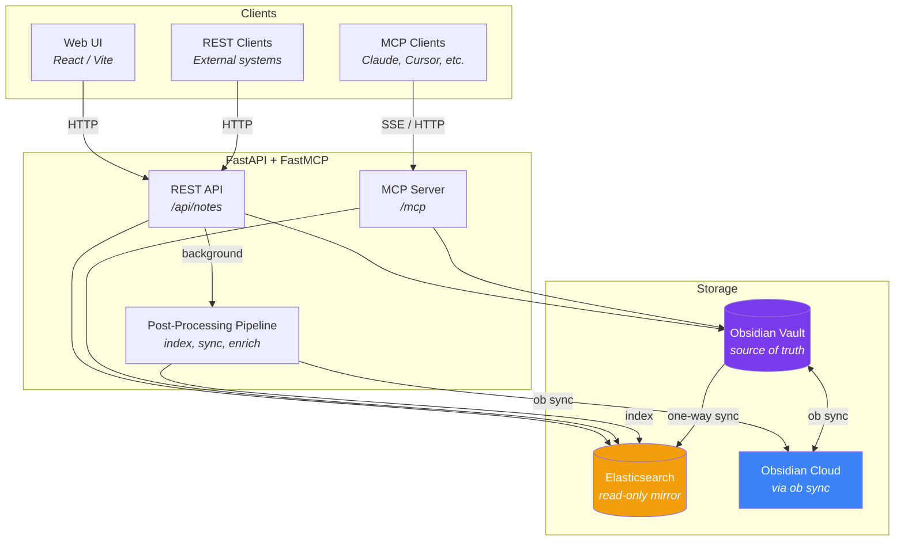

# Obsidian Knowledge

Agentic knowledge server that unifies knowledge across projects. Uses an Obsidian vault as the source of truth with Elasticsearch as a searchable read-only mirror. Exposes both a REST API and MCP server for agentic access.

## Architecture



- **Obsidian vault** (`vaults/AgentKnowledge/`) is the source of truth
- **One-way sync**: vault → Elasticsearch. Writes never go to ES directly.
- **`ob sync`** keeps the vault in sync with Obsidian cloud (headless, no desktop app)
- **Post-processing pipeline** runs in background after note creation (indexing, sync, future cross-linking)

## Setup

```bash
cp .env.example .env
# Fill in ES_CLOUD_ID, ES_API_KEY, ANTHROPIC_API_KEY

make build
make up
```

### Local development

```bash
# Install dependencies (Python 3.12, uv)
uv sync --extra dev

# Run services
make dev-backend     # Backend with hot reload (port 8000)
make dev-frontend    # Frontend dev server (port 5173)

# Test & lint
make test
make lint
```

The Python virtual environment lives at `~/.venvs/obsidian-knowledge` and is symlinked as `.venv` at the repo root.

## Ingest API

```bash
curl -X POST http://localhost:8000/api/notes \
  -H "Content-Type: application/json" \
  -d '{
    "path": "Inbox/meeting-notes.md",
    "content": "# Meeting Notes\n\nDiscussed project timeline.",
    "metadata": {"tags": ["meeting"], "source": "slack"}
  }'
```

`content` is raw markdown, passed through as-is. `metadata` becomes YAML frontmatter in the Obsidian note.

## MCP

The MCP server is mounted at `/mcp` and exposes tools for agentic access:

- `search` — full-text search
- `semantic` — semantic search via Jina embeddings
- `read` — read a specific note
- `create` — create/update a note
- `list_all_notes` — list notes, optionally by folder
- `reindex` — full vault → ES resync

## Tech Stack

- **Backend**: Python 3.12, FastAPI, FastMCP, Elasticsearch, uv
- **Frontend**: React 19, Vite, TypeScript
- **Infrastructure**: Docker Compose, Obsidian Headless (`ob sync`)
