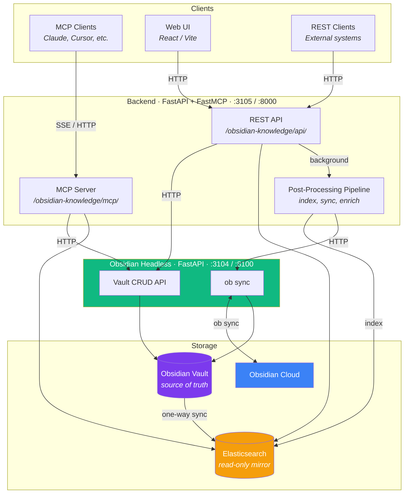

# Obsidian Knowledge

Agentic knowledge server that unifies knowledge across projects. Uses an Obsidian vault as the source of truth with Elasticsearch as a searchable read-only mirror. Exposes both a REST API and MCP server for agentic access.

## Architecture



### Services

| Service | Docker | Dev | Role |
|---------|--------|-----|------|
| **obsidian-headless** | 8100 | 3104 | Owns the vault filesystem and `ob` CLI. FastAPI service for vault read/write/list/delete and sync. Only container that mounts `vaults/`. |
| **backend** | 8000 | 3105 | FastAPI + FastMCP. REST API + MCP server for external access. Calls headless for vault I/O, manages ES indexing and post-processing pipeline. |
| **frontend** | 5173 | 8104 | React/Vite search UI. |

The backend never touches vault files directly — all vault I/O goes through the obsidian-headless service via HTTP.

## Prerequisites

### Obsidian Headless

Requires an [Obsidian Sync](https://obsidian.md/sync) subscription. Install the headless client and set up vault sync per the [official docs](https://obsidian.md/help/sync/headless):

```bash
# Install the headless client
npm install -g obsidian-headless

# Log in to your Obsidian account
ob login

# Create a remote vault (first time only), or list existing ones
ob sync-create-remote --name "AgentKnowledge"
# or: ob sync-list-remote

# Link the local vault directory to the remote vault
ob sync-setup --vault AgentKnowledge --path vaults/AgentKnowledge

# Pull down existing notes (or confirm sync is working)
ob sync --path vaults/AgentKnowledge

# Check sync status
ob sync-status --path vaults/AgentKnowledge
```

After setup, `ob sync` will push and pull changes between this server and Obsidian cloud. The backend triggers `ob sync` automatically after note creation via the API.

### Environment

```bash
cp .env.example .env
# Fill in ES_URL, ES_API_KEY, ANTHROPIC_API_KEY, ELASTIC_APM_* values
```

## Setup

```bash
make init            # Install frontend npm deps + Python dev deps
```

### Production (Docker Compose)

```bash
make build           # Build all containers
make up              # Start all services
make down            # Stop all services
make redeploy        # down + build + up
make logs            # Tail logs
```

### Local development (bare metal)

```bash
make dev             # Start all 3 services with hot reload
make dev-stop        # Stop all dev servers
```

Dev logs are written to `/tmp/ok-headless.log`, `/tmp/ok-backend.log`, `/tmp/ok-frontend.log`.

### Testing

```bash
make test            # Run pytest
make lint            # Run ruff
```

The Python virtual environment lives at `~/.venvs/obsidian-knowledge` and is symlinked as `.venv` at the repo root.

## URL Prefix

All endpoints are served under a configurable prefix (default: `/obsidian-knowledge`) to support reverse proxy deployments. All paths end with `/` to avoid 301 redirects. Set `API_PREFIX` in `.env` to change the prefix.

## Ingest API

```bash
# Dev port 3105, Docker port 8000
curl -X POST http://localhost:3105/obsidian-knowledge/api/notes/ \
  -H "Content-Type: application/json" \
  -d '{
    "path": "Inbox/meeting-notes.md",
    "content": "# Meeting Notes\n\nDiscussed project timeline.",
    "metadata": {"tags": ["meeting"], "source": "slack"}
  }'
```

`content` is raw markdown, passed through as-is. `metadata` becomes YAML frontmatter in the Obsidian note.

## MCP

The MCP server is mounted at `/obsidian-knowledge/mcp/` and exposes tools for agentic access:

- `search` — full-text search
- `semantic` — semantic search via Jina embeddings
- `read` — read a specific note
- `create` — create/update a note
- `list_all_notes` — list notes, optionally by folder
- `reindex` — full vault → ES resync

## Tech Stack

- **Backend**: Python 3.12, FastAPI, FastMCP, Elasticsearch, uv
- **Obsidian Headless**: Python 3.12, FastAPI, Node.js (for `ob` CLI)
- **Frontend**: React 19, Vite, TypeScript
- **Infrastructure**: Docker Compose, Obsidian Headless (`ob sync`)
