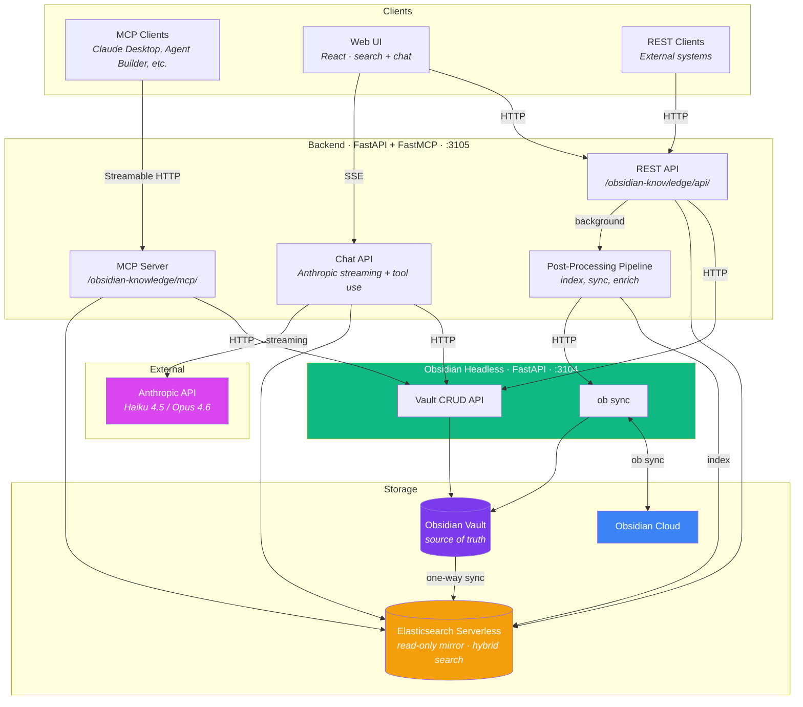

# Obsidian Knowledge

Agentic knowledge server that unifies knowledge across projects. Uses an Obsidian vault as the source of truth with Elasticsearch as a searchable read-only mirror. Exposes a REST API, MCP server, and built-in chatbot for agentic access.

## Architecture



### Services

Same ports for both local dev (`make dev`) and Docker (`make up`):

| Service | Port | Role |
|---------|------|------|
| **obsidian-headless** | 3104 | Owns the vault filesystem and `ob` CLI. FastAPI service for vault read/write/list/delete and sync. Only container that mounts `vaults/`. Runs as host user (uid 1000) to preserve file permissions. |
| **backend** | 3105 | FastAPI + FastMCP. REST API + MCP server + chat endpoint. Calls headless for vault I/O, manages ES indexing and post-processing pipeline. |
| **frontend** | 8104 (dev) | React/Vite UI with search, note viewer, and built-in chatbot. In production: static files served by nginx from `frontend/dist/`. |

The backend never touches vault files directly — all vault I/O goes through the obsidian-headless service via HTTP.

## Prerequisites

### Obsidian Headless

Requires an [Obsidian Sync](https://obsidian.md/sync) subscription. Install the headless client and set up vault sync per the [official docs](https://obsidian.md/help/sync/headless):

```bash
# Install the headless client
npm install -g obsidian-headless

# Log in to your Obsidian account
ob login

# Create a remote vault (first time only), or list existing ones
ob sync-create-remote --name "AgentKnowledge"
# or: ob sync-list-remote

# Link the local vault directory to the remote vault
ob sync-setup --vault AgentKnowledge --path vaults/AgentKnowledge

# Pull down existing notes (or confirm sync is working)
ob sync --path vaults/AgentKnowledge

# Check sync status
ob sync-status --path vaults/AgentKnowledge
```

After setup, `ob sync` will push and pull changes between this server and Obsidian cloud. The backend triggers `ob sync` automatically after note creation via the API.

To periodically pull changes made on other devices, add a cron job. A helper script is provided at `scripts/ob-sync.sh` that sets up the nvm PATH (cron doesn't load it) and triggers an ES reindex if changes are detected:

```bash
crontab -e
```

```
*/5 * * * * /home/dave/dev/obsidian-knowledge/scripts/ob-sync.sh >> /tmp/ok-obsidian-sync.log 2>&1
```

### Environment

```bash
cp .env.example .env
# Fill in ES_URL, ES_API_KEY, ANTHROPIC_API_KEY, MCP_API_KEY, ELASTIC_APM_* values
```

## Setup

```bash
make init            # Install frontend npm deps + Python dev deps
```

### Production (Docker Compose)

```bash
make build           # Build all containers
make up              # Start all services
make down            # Stop all services
make redeploy        # down + build + up
make logs            # Tail logs
make sync-fix        # Kill stuck ob sync processes + redeploy
```

### Production with nginx

When serving behind nginx, the frontend is built as static files and served directly by nginx (no frontend container needed):

```bash
make build-frontend  # Build static files to frontend/dist/
```

nginx serves `/obsidian-knowledge/` from `frontend/dist/`, proxies `/obsidian-knowledge/api/` and `/obsidian-knowledge/mcp/` to the backend on port 3105. The MCP endpoint uses `proxy_http_version 1.1` for SSE streaming support. Run `make build-frontend` after any frontend code changes.

### Local development (bare metal)

```bash
make dev             # Start all 3 services with hot reload
make dev-stop        # Stop all dev servers
```

Dev logs are written to `/tmp/ok-headless.log`, `/tmp/ok-backend.log`, `/tmp/ok-frontend.log`.

### Testing

```bash
make test            # Run unit tests (excludes integration)
make test-integration # Run integration tests (requires make dev or make up)
make lint            # Run ruff
```

`make test-integration` runs an end-to-end lifecycle test: create a note, read it via headless and backend, search it in Elasticsearch (full-text and hybrid semantic), verify deletion from both vault and ES. Works against either `make dev` or `make up` since both use the same ports.

The Python virtual environment lives at `~/.venvs/obsidian-knowledge` and is symlinked as `.venv` at the repo root.

## URL Prefix

All endpoints are served under a configurable prefix (default: `/obsidian-knowledge`) to support reverse proxy deployments. All paths end with `/` to avoid 301 redirects. Set `API_PREFIX` in `.env` to change the prefix.

## Vault Organization

- **Root level**: Primary entries on people, concepts, or tools (`Dave Erickson.md`, `Elasticsearch.md`)
- **Meetings/**: Time-driven meeting notes as `Meetings/YYYY-MM-DD-Meeting-Name.md`
- **Observations/**: Journal entries and daily notes as `Observations/YYYY-MM-DD-Topic.md`
- **Content/**: Notes on consumed content (videos, articles, books) as `Content/Title.md`
- **Inbox/**: Staging area for unsorted or auto-ingested notes

### Daily Notes

Daily notes live at `Observations/YYYY-MM-DD-Daily.md` with tags `daily` and `observation`. They capture the day's plans, reflections, and link to other vault entries. The web UI has a "Today" button that creates or opens the current day's note.

## Ingest API

```bash
curl -X POST http://localhost:3105/obsidian-knowledge/api/notes/ \
  -H "Content-Type: application/json" \
  -d '{
    "path": "Inbox/meeting-notes.md",
    "content": "# Meeting Notes\n\nDiscussed project timeline.",
    "metadata": {"tags": ["meeting"], "source": "slack"}
  }'
```

`content` is raw markdown, passed through as-is. `metadata` becomes YAML frontmatter in the Obsidian note.

## Web UI

The frontend is a responsive React app with three main panels:

- **Note list** (left): Search results or 20 most recent notes. Uses hybrid semantic search (BM25 + Jina vector embeddings).
- **Note viewer** (center): Rendered markdown with clickable `[[wikilinks]]`, dead link detection (red strikethrough for notes that don't exist yet), tags, and metadata.
- **Chat** (right): Built-in Claude chatbot (Haiku 4.5 or Opus 4.6) with streaming responses and full tool access to the knowledge base. Knows which note you have focused and the current date/timezone.

On mobile: single-panel layout with tab navigation (Notes / View / Chat).

Light and dark themes default to OS preference with manual toggle.

## MCP

The MCP server is mounted at `/obsidian-knowledge/mcp/` and exposes tools for agentic access:

- `search` — full-text BM25 search
- `semantic` — hybrid search (linear fusion of BM25 + Jina vector embeddings)
- `read` — read a specific note
- `create` — create/update a note (indexes to ES + triggers ob sync)
- `delete` — delete a single note (removes from vault + ES + triggers ob sync)
- `list_all_notes` — list notes, optionally by folder
- `reindex` — full vault → ES resync

The server includes instructions guiding agents on vault organization, daily notes, wikilink conventions, and search tool selection.

### Authentication

The MCP endpoint is protected with Bearer token authentication. Set `MCP_API_KEY` in `.env` to enable it. When set, clients must send `Authorization: Bearer <key>` with each request. When unset, the MCP endpoint is open (useful for local dev).

### Connecting from Claude Desktop

Configure via **Settings > Connectors**:
- URL: `http://your-server:1071/obsidian-knowledge/mcp/`
- Auth: Bearer token with your `MCP_API_KEY` value

### Connecting from Claude Code

```bash
claude mcp add obsidian-knowledge --transport http \
  http://your-server:1071/obsidian-knowledge/mcp/ \
  --header "Authorization: Bearer your-mcp-api-key"
```

### Connecting from Elastic Agent Builder

Add as an MCP connector in the Agent Builder UI with the endpoint URL and Bearer token. Since MCP clients only receive tools (not the server instructions), copy the vault organization and daily notes documentation into your Agent Builder system prompt.

### Connecting from other MCP clients

Any MCP client that supports Streamable HTTP transport can connect to:

```
http://your-server:1071/obsidian-knowledge/mcp/
```

Send `Authorization: Bearer <MCP_API_KEY>` in the request headers. Replace `your-server` with your server's hostname or IP. Use port 3105 for direct access without nginx.

## Tech Stack

- **Backend**: Python 3.12, FastAPI, FastMCP, Anthropic SDK, Elasticsearch, Elastic APM, uv
- **Obsidian Headless**: Python 3.12, FastAPI, Elastic APM, Node.js (for `ob` CLI)
- **Frontend**: React 19, Vite, TypeScript, react-markdown
- **Search**: Elasticsearch Serverless, Jina v3 small embeddings via `semantic_text`, hybrid retriever with linear fusion
- **Chat**: Anthropic API (Haiku 4.5 / Opus 4.6) with streaming tool use
- **Infrastructure**: Docker Compose, nginx, Obsidian Headless (`ob sync`)
